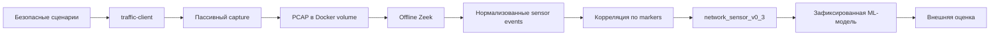

# Платформа «Филин»

## Назначение

«Филин» — исследовательская платформа для разработки и проверки методов интеллектуального мониторинга сетевого трафика и обнаружения лабораторных инцидентов информационной безопасности.

## Реализованный pipeline

## Компоненты

- `lab/` — изолированный стенд, кампании, capture и Zeek;
- `ml/features/` — схемы, builders и validators;
- `ml/analysis/` — audits и диагностические анализы;
- `ml/experiments/` — baseline и robustness evaluation;
- `datasets/` — описание runtime datasets;
- `docs/` — единая карта документации.

## Текущая версия

v0.3.2 подтвердил внешнюю оценку зафиксированной модели на 12 robustness-runs. Robustness-данные не участвовали в обучении, выборе признаков, preprocessing или настройке гиперпараметров.

## Лабораторный стенд и сенсор

Capture выполняется пассивно в network namespace `traffic-client`; исходный PCAP хранится в Docker-managed volume и обрабатывается offline Zeek. Start/end markers задают sensor-aligned intervals и исключаются из model features.

События `network_sensor_v0_3` формируются только из фактически захваченного сетевого трафика. Traffic-client events используются для контрольного сравнения и не являются источником Zeek-событий или сетевых признаков.

## Профили признаков

`client_core_v0_2` и `client_extended_v0_2` описывают client observations. `network_sensor_v0_3` строится по Zeek flow, HTTP и доступным DNS observations. Packet/flow-признаки не подставляются в client profiles.

## ML experiments

v0.3.1 сравнил client и независимый сетевой профиль на train/test runs; рекомендован `network_sensor_v0_3`. v0.3.2 оценил неизменную LogisticRegression с median imputer и StandardScaler на external robustness-runs. Интеграция в backend не начата.

## Воспроизводимость и ограничения

Команды, структура артефактов и проверки приведены в [документации](docs/index.md). Полученные результаты относятся к контролируемому лабораторному стенду и не подтверждают готовность модели к эксплуатации в производственной инфраструктуре.

## Структура каталога

См. [архитектуру](docs/architecture.md), [происхождение данных](docs/data-provenance.md), [эксперименты](docs/experiments.md) и [roadmap](docs/roadmap.md).
