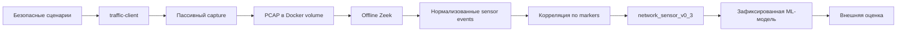

# Платформа «Филин»

## Текущий статус исследования

Авторитетный источник: [`docs/research-state.yaml`](docs/research-state.yaml).

- Последний завершённый этап: v0.3.12.
- Итог последнего этапа: frozen multi-benchmark regression завершена, но не пройдена из-за недостаточного evaluation coverage и episode gate.
- Активная работа: этап v0.3.12 завершён; frozen candidate v0.3.11 не изменён.
- Следующий допустимый этап: новый training cycle на новых данных; v0.3.13 blind holdout не разрешён.
- Интеграция с backend разрешена: нет.
- Теневой режим разрешён: нет.
- Готовность к промышленной эксплуатации: нет.

Исторические метрики v0.3.1–v0.3.9 остаются неизменными. В v0.3.10 успешно
пройдены integrity, closed-set, calibration, conformal, strong-path и episode
gates, но training-only model-selection policy и pending/review gate не
пройдены; backend, shadow mode и production остаются запрещены.

В v0.3.12 кандидат `v0311:19176acb401be2d4` без fit и tuning оценён на двух совместимых frozen наборах: v0.3.9 (252 окна) и v0.3.10 (324 окна). Наборы v0.3.6 и v0.3.7 заблокированы из-за отсутствия готовой 51-признаковой таблицы, v0.3.8 — из-за расхождения 216 фактических и 252 ожидаемых строк. Regression не пройдена; shadow mode и backend integration не разрешены.

## Назначение

«Филин» — исследовательская платформа для разработки и проверки методов интеллектуального мониторинга сетевого трафика и обнаружения лабораторных инцидентов информационной безопасности.

## Реализованный pipeline

## Компоненты

- `lab/` — изолированный стенд, кампании, capture и Zeek;
- `ml/features/` — схемы, builders и validators;
- `ml/analysis/` — audits и диагностические анализы;
- `ml/experiments/` — baseline и robustness evaluation;
- `datasets/` — описание runtime datasets;
- `docs/` — единая карта документации.

## Текущая версия

v0.3.10 завершил отдельный minimal-promotion training/internal-validation cycle,
но его frozen policy не пройдена. Он не разрешает backend integration, shadow
mode или production deployment. Подробный текущий статус определяется только
`docs/research-state.yaml`.

## Лабораторный стенд и сенсор

Capture выполняется пассивно в network namespace `traffic-client`; исходный PCAP хранится в Docker-managed volume и обрабатывается offline Zeek. Start/end markers задают sensor-aligned intervals и исключаются из model features.

События `network_sensor_v0_3` формируются только из фактически захваченного сетевого трафика. Traffic-client events используются для контрольного сравнения и не являются источником Zeek-событий или сетевых признаков.

## Профили признаков

`client_core_v0_2` и `client_extended_v0_2` описывают client observations. `network_sensor_v0_3` строится по Zeek flow, HTTP и доступным DNS observations. Packet/flow-признаки не подставляются в client profiles.

## ML experiments

v0.3.1 сравнил client и независимый сетевой профиль на train/test runs; рекомендован `network_sensor_v0_3`. v0.3.2 оценил неизменную LogisticRegression с median imputer и StandardScaler на external robustness-runs. Интеграция в backend не начата.

## Воспроизводимость и ограничения

Команды, структура артефактов и проверки приведены в [документации](docs/index.md). Полученные результаты относятся к контролируемому лабораторному стенду и не подтверждают готовность модели к эксплуатации в производственной инфраструктуре.

## Структура каталога

См. [архитектуру](docs/architecture.md), [происхождение данных](docs/data-provenance.md), [эксперименты](docs/experiments.md) и [roadmap](docs/roadmap.md).

## История выделения

Платформа выделена в самостоятельный репозиторий из прежнего подкаталога. Технические детали и ограничения provenance приведены в [документе о миграции](docs/repository-migration.md).

## Технический аудит v0.3.12.1

Read-only аудит показал, что frozen detection-by-second `0.733333` воспроизводится из порядка записей immutable prediction, а не из causal order эпизодов. В причинном порядке alerts созданы 29/1/0 и 60/0/0 по окнам; state-machine extra delay и подавление первого alert равны нулю. Официальный отрицательный результат v0.3.12 и запрет v0.3.13, shadow mode и backend integration не изменены. Подробности: [аудит v0.3.12.1](docs/experiments/v0_3_12_1.md).
