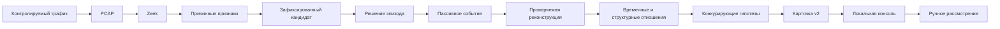

# Платформа «Филин»

> Лабораторная линия: v0.4.7.3 завершён с решением `failed_validation`. Слепая процедура корректна, но обязательные требования пройдены не полностью; предложение не зарегистрировано, действующий кандидат не изменён, v0.4.8 запрещён. Допустим только анализ v0.4.7.4. Основная линия по-прежнему ожидает v0.3.19.

«Филин» — исследовательская платформа для воспроизводимого анализа сетевых событий:
от контролируемого сетевого трафика и зафиксированной модели до проверяемой
реконструкции, конкурирующих гипотез и ручного рассмотрения карточки оператором.

> **Граница применимости:** лабораторная работоспособность подтверждена, внешняя
> применимость пока не подтверждена. Платформа не является SIEM, не подтверждает
> компрометацию и не выполняет автоматические действия.

## Текущий статус

Проект ведёт две логически независимые линии. Лабораторная линия использует
неизменяемые выходы основной, но не заменяет внешнюю проверку.

| Линия | Завершённый этап | Подтверждённый результат | Следующий допустимый этап |
|---|---|---|---|
| Основная `v0.3.x` | `v0.3.18` | Подготовлен и синтетически отрепетирован зафиксированный пакет внешней проверки | `v0.3.19`: независимая проверка пакета и согласование плана испытания |
| Лабораторная `v0.4.x` | `v0.4.7.3` | Новый слепой проход корректен технически, но завершён `failed_validation` | `v0.4.7.4`: анализ причин либо закрытие предложения; `v0.4.8` запрещён |

Авторитетные машиночитаемый источники: [основная линия](docs/status/project-status.yaml)
и [лабораторная линия](docs/status/v0_4_track.yaml). Человекочитаемая сводка находится
в [текущем статусе](docs/status/current-status.md).

## Что действительно реализовано

- причинное 51-признаковое представление сетевого потока;
- зафиксированный кандидат `v03154:65a3dd912d845bc1`;
- воспроизводимый зафиксированное применение модели и эпизодное решение в проверенной лабораторной области;
- пассивное событие `shadow_event_v2` и локальная надёжная доставка;
- преобразование подтверждающих материалов в наблюдаемые факты;
- временные и структурные отношения без утверждения причинности;
- явные разрывы реконструкции и группы корреляции;
- конкурирующие гипотезы без принудительного выбора победителя;
- карточка инцидента v2 и каталог из 12 синтетических лабораторных случаев;
- локальная лабораторная консоль с сохраняемым ручным рассмотрением;
- детерминированный экспорт решения оператора без изменения зафиксированных подтверждающих материалов;
- каталог воспроизводимых лабораторных запусков и безопасное сравнение v0.4.5;
- контур предложений кандидата v0.4.6 с зафиксированными разбиением и рецептом, двумя запусками обучения, предварительной проверкой, обязательными критериями допуска и ручным решением без регистрации кандидата;
- слепая проверка v0.4.7 с закрытой разметкой, предварительной фиксацией двух пакетов прогнозов, детерминированной оценкой и решением «проверка не пройдена» (`failed_validation`) без регистрации или продвижения модели.
- анализ v0.4.7.1 с пересчётом ошибок по замороженным прогнозам, уровнями доказательности причин, журналом переноса знаний и автономной политикой внутренней разработки.
- новое предложение v0.4.7.2 и его слепая проверка v0.4.7.3 на 36 новых сессиях с техническим разделением ролей, контролируемым восстановлением и честным отрицательным решением.

Полная матрица подтверждений и ограничений: [подтверждённые возможности](docs/status/confirmed-capabilities.md).

## Сквозная архитектура


```mermaid
flowchart LR
    A["Контролируемый трафик"] --> B["PCAP"]
    B --> C["Zeek"]
    C --> D["Причинные признаки"]
    D --> E["Зафиксированный кандидат"]
    E --> F["Решение эпизода"]
    F --> G["Пассивное событие"]
    G --> H["Проверяемая реконструкция"]
    H --> I["Временные и структурные отношения"]
    I --> J["Конкурирующие гипотезы"]
    J --> K["Карточка v2"]
    K --> L["Локальная консоль"]
    L --> M["Ручное рассмотрение"]
```

Линия `v0.3.x` заканчивается проверенным локальным приёмом пассивного события и
подготовкой внешней процедуры. Линия `v0.4.x` начинается с неизменяемого пассивного
события и строит над ним лабораторную реконструкцию. Она не переобучает модель,
не меняет кандидата и не повышает его внешний статус.

Подробнее: [архитектурный обзор](docs/architecture/overview.md) и
[сквозной поток данных](docs/architecture/end-to-end-data-flow.md).

## Текущий кандидат

| Поле | Значение |
|---|---|
| Идентификатор кандидата | `v03154:65a3dd912d845bc1` |
| Контракт признаков | `network_features_v2` |
| Манифест кандидата | `ml/artifacts/v0_3_15_4/candidate_manifest.json` |
| Реестр кандидатов | `collectors/shadow/contracts/candidate_registry_v1.json` |
| Внешняя проверка | не завершена |
| Промышленная готовность | отсутствует |

История получения и проверок: [линия кандидата](docs/research/candidate-lineage.md).

## Быстрый безопасный старт

Команды выполняются из корня репозитория и не требуют внешних данных.

### Подготовка окружения

```powershell
python -m pip install -r requirements.txt
```

Установка изменяет только выбранное окружение Python. Сетевой доступ может
потребоваться для загрузки отсутствующих зависимостей.

### Полная проверка

```powershell
python -m pytest -q
```

Ожидается `0 failed`. Фактическое количество `passed` фиксируется только в отчёте
конкретного запуска.

### Лабораторная консоль

```powershell
$env:FILIN_CONSOLE_TOKEN = "локальный-одноразовый-токен"
python -m lab_console --host 127.0.0.1 --port 8043
```

Откройте `http://127.0.0.1:8043/ui/cases`. Консоль принимает только localhost,
не предоставляет публичный сервис и пишет операторский изменяемый слой в `runtime/lab_console/`.

### Проверка карточек и операторского цикла

```powershell
python -m tools.lab_console.verify_v044
```

Команда проверяет Зафиксировано комплект v0.4.4 и не запускает новый исследовательский цикл.
Подробности: [руководство по консоли](docs/getting-started/laboratory-console.md),
[работа с карточками](docs/getting-started/reviewing-laboratory-cards.md) и
[справочник команд](docs/reference/command-reference.md).

## Основные каталоги

| Каталог | Назначение | Статус |
|---|---|---|
| `collectors/` | сбор событий, реестр кандидатов и пассивный среда выполнения | текущий |
| `ml/` | признаки, кандидат, протоколы, кампании и Зафиксировано reports | текущий и исторический подтверждающие материалы |
| `staging/` | изолированный эталонный приёмник событий | текущий лабораторный среда выполнения |
| `rehearsal/` | контролируемая локальная репетиция | текущий лабораторный инструмент |
| `incident_reconstruction/` | факты, отношения, разрывы, гипотезы и карточки | текущий лабораторный компонент |
| `lab_console/` | локальный интерфейс и операторский изменяемый слой | текущий лабораторный компонент |
| `external_review/` | исполняемые контракты внешней процедуры | Зафиксировано/ограниченный |
| `backend/` | ранний демонстрационный прототип | исторический, не в текущем пути |
| `docs/` | текущая навигация, статус, справочники и история | текущий документационный слой |
| `runtime/` | локальные изменяемые результаты запусков | не является подтверждающие материалы по умолчанию |

Полная карта: [структура репозитория](docs/getting-started/repository-layout.md).

## Маршруты для читателей

- **Новый читатель:** [обзор](docs/getting-started/overview.md) →
  [статус](docs/status/current-status.md) → [архитектура](docs/architecture/overview.md).
- **Разработчик:** [точка входа](docs/getting-started/developer-entrypoint.md) →
  [компоненты](docs/reference/component-directory.md) → [тестирование](docs/getting-started/testing.md).
- **Оператор:** [запуск консоли](docs/getting-started/laboratory-console.md) →
  [рассмотрение карточки](docs/getting-started/reviewing-laboratory-cards.md).
- **Аудитор:** [источники истины](docs/reference/sources-of-truth.md) →
  [протоколы](docs/protocols/index.md) → [отчёты](docs/reports/index.md).
- **Независимый эксперт:** [точка входа](docs/getting-started/external-review-entrypoint.md) →
  [полное русское изложение пакета](docs/guides/external-review/README.md).

Полный документационный портал: [docs/index.md](docs/index.md).

## Главные ограничения

- использованы контролируемые и синтетические среды; внешняя применимость не доказана;
- `v0.3.18` подготовил процедуру, но не провёл реальное внешнее испытание;
- `v0.4.4` подтверждает операторский цикл только на 12 предусмотренных случаях;
- гипотеза, путь графа и временное предшествование не являются установленным фактом или причиной;
- `better_supported` означает только более сильную опору в доступных сведениях;
- заметки оператора и состояние рассмотрение не становятся подтверждающим материалом;
- запрещены публичный доступ, промышленная интеграция, реальные уведомления, блокирование и автоматический ответ;
- исторический `backend/` не входит в проверенный путь платформы.

Канонические страницы: [текущие ограничения](docs/architecture/limitations.md) и
[запрещённые возможности](docs/status/prohibited-capabilities.md).

## Целостность и история

Зафиксировано protocols, manifests, detached SHA и утверждение-подтверждающие материалы ledgers не редактируются
задним числом. Современная документация ссылается на них и отделяет подтверждённое
от исторического. Иерархия источников истины описана в
[справочнике](docs/reference/sources-of-truth.md), а полная история — в
[хронологии этапов](docs/history/stage-timeline.md).

## Лицензирование и безопасность

Перед распространением проверьте [лицензии зависимостей](docs/dependency-licenses.md),
[модель безопасности](docs/safety-model.md) и правила конкретного Зафиксировано package.
Документация не является юридическим заключением или разрешением на испытание.

## Лицензирование

Собственный программный код распространяется по MPL-2.0, собственная документация — по CC-BY-4.0. Точный область применимости, исключения для моделей и данных, third-party notices и профили распространения описаны в [центре лицензирования](docs/licensing/index.md). Название и графические обозначения не предоставляются по лицензии программного кода.

Официальные тексты лицензий и DCO включены как неизменённые upstream standard texts и не являются произведениями автора проекта. Техническая готовность к распространению подтверждена только для `source-core` и `laboratory-source`; контейнерный автономного режима комплект не одобрен, модели и Наборы данных требуют отдельной лицензии.

## Лабораторные запуски v0.4.5

Локальная консоль ведёт каталог воспроизводимых запусков и безопасно сравнивает их результаты. План, вход, кандидат, окружение и зависимости фиксируются до выполнения; прерванный запуск восстанавливается только явным действием оператора. Сравнение сначала проверяет сопоставимость и не выбирает победителя, не изменяет текущего кандидата и не разрешает промышленная эксплуатация. Руководства: [повтор лабораторного запуска](docs/getting-started/running-laboratory-replays.md) и [сравнение запусков](docs/getting-started/comparing-laboratory-runs.md).

## Предложения лабораторных кандидатов v0.4.6

Консоль готовит предложение кандидата только из Перечень разрешённых значений synthetic data и Зафиксировано рецепт, проверяет независимое повторное обучение, выполняет предварительная внутренняя проверка и сохраняемое ручное рассмотрение. предложение кандидата не получает `candidate_id`, не входит в реестр и не может быть автоматически активировано или продвинуто. Руководства: [подготовка предложение кандидата](docs/getting-started/preparing-candidate-proposals.md) и [ручное рассмотрение](docs/getting-started/reviewing-candidate-proposals.md).
