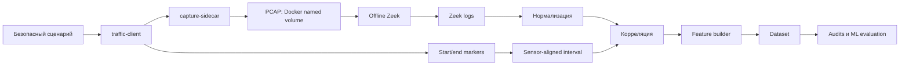
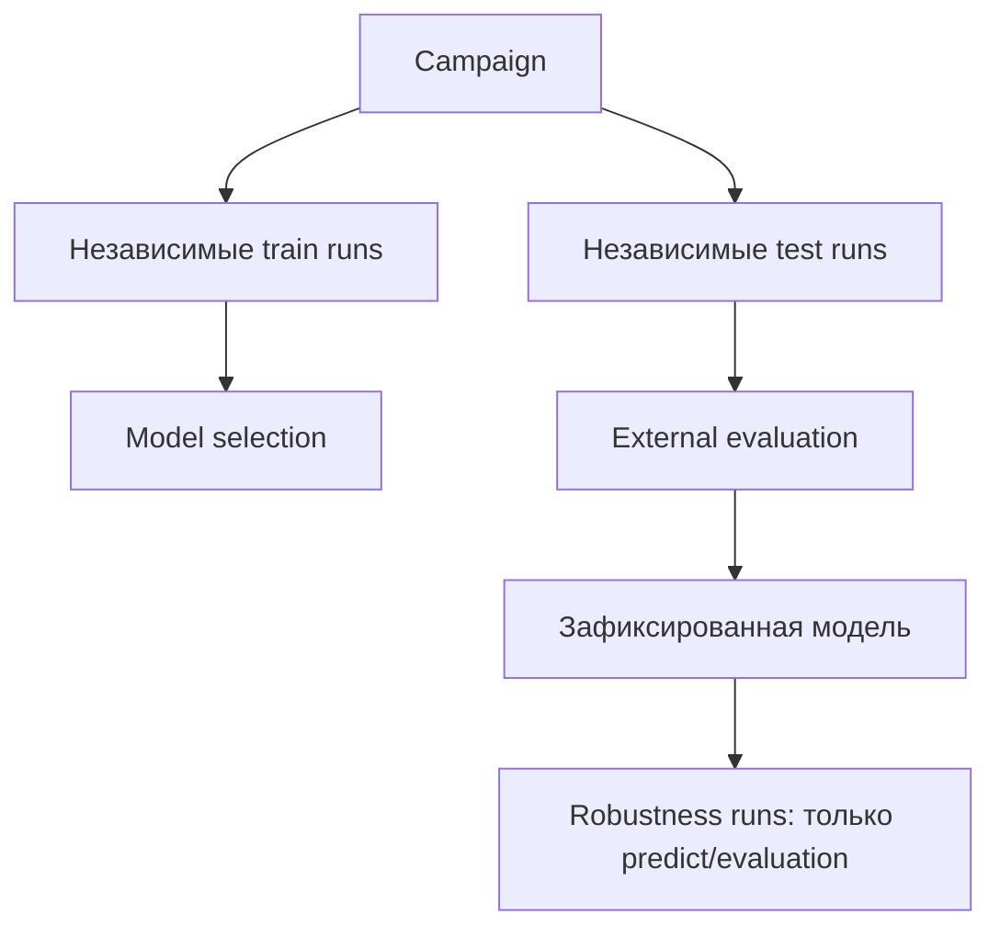
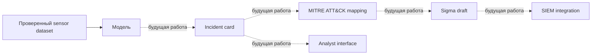

# Архитектура

## Реализованная архитектура

`traffic-client` выполняет безопасные действия в изолированной сети. Capture-sidecar наблюдает тот же network namespace; PCAP является первичным источником sensor observations. Zeek logs нормализуются до корреляции. Execution markers используются только для временной привязки и исключаются из feature aggregation.

## Campaign separation

## Концептуальная будущая архитектура

Концептуальная архитектура. На текущем этапе полностью не реализована.
