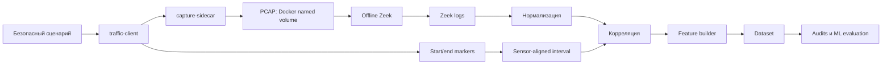
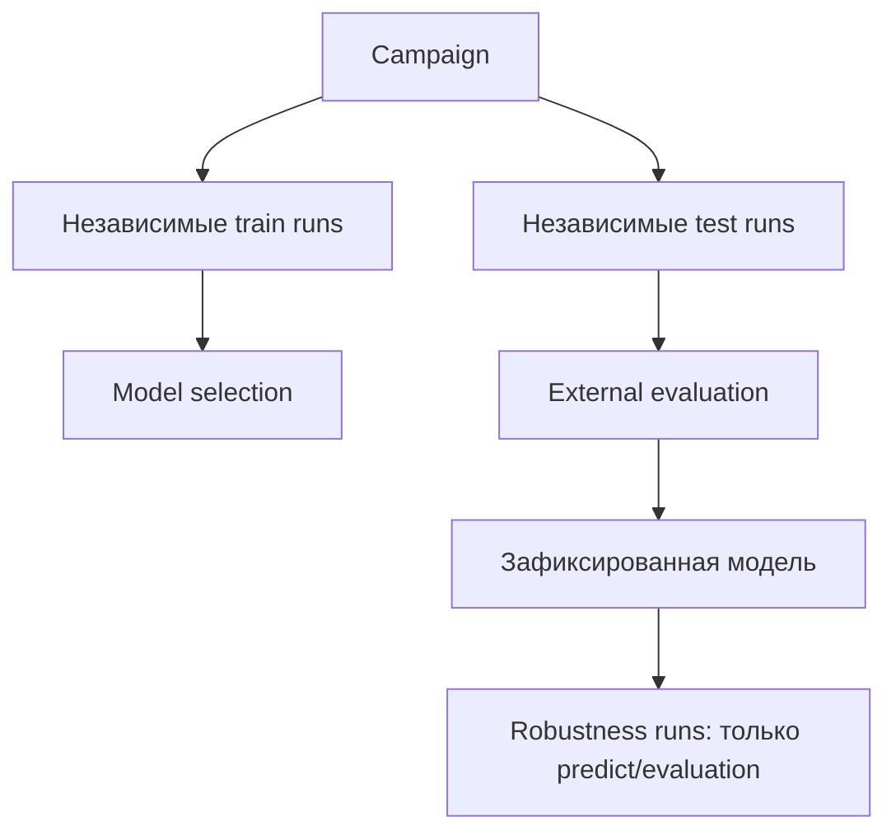
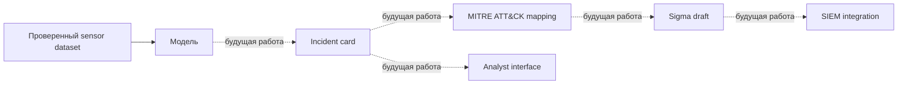
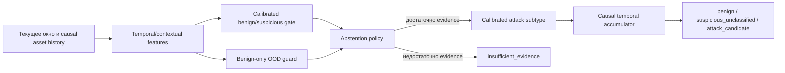
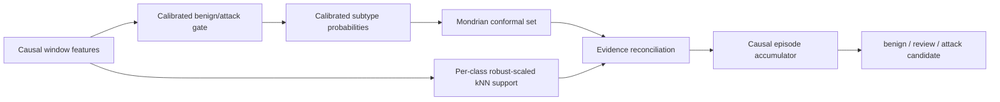

# Архитектура

## Реализованная архитектура

`traffic-client` выполняет безопасные действия в изолированной сети. Capture-sidecar наблюдает тот же network namespace; PCAP является первичным источником sensor observations. Zeek logs нормализуются до корреляции. Execution markers используются только для временной привязки и исключаются из feature aggregation.

В v0.3.7 internal validation каждый execution дополнительно захватывается в отдельный PCAP внутри namespace `traffic-client`. Такая изоляция сохраняет marker-семантику, но не позволяет откату Docker wall-clock смешать соседние окна. Marker control journal служит только аудитируемым источником границ; labels и control records не агрегируются в model features.

## Campaign separation

## Концептуальная будущая архитектура

Концептуальная архитектура. На текущем этапе полностью не реализована.

## network_sensor_v0_5_hierarchical

Detection отделён от subtype classification: benign gate не вызывает subtype model. OOD не конвертируется в attack автоматически. Asset state сбрасывается между runs и folds; warm-up инициализирует state, но исключён из support и metrics.

## Class-conditional evidence v0.3.8

Conformal scores и support thresholds обучаются только на group-aware training OOF. Решение класса требует согласования вероятности, conformal membership и support; отсутствие support ведёт к review, а не автоматически к атаке. Episode state изолирован по run и asset и использует только текущие/предыдущие окна.
