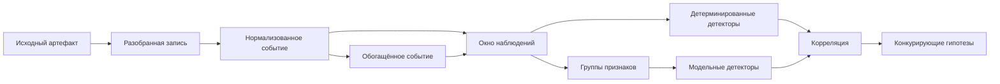
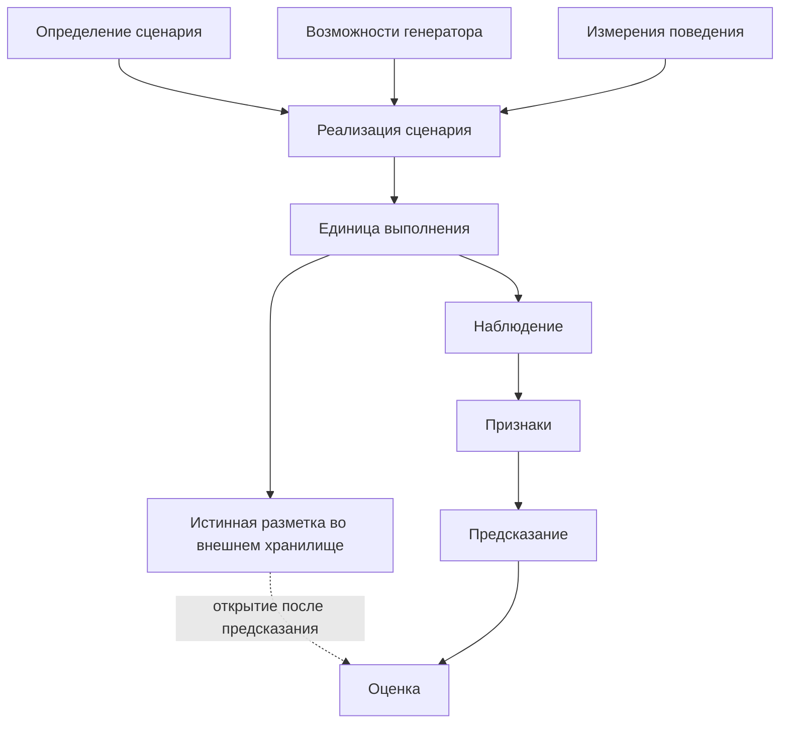

# Архитектура телеметрии и сценариев Filin следующего поколения

## Статус и границы

Документ определяет инженерную основу, а не научно подтверждённые возможности обнаружения. Новые контракты и каталоги имеют статус `planned`, кроме явно отмеченных существующих адаптеров. Научная кампания, обучение, сбор нового набора данных, фиксация нового кандидата и создание пакета выполнения не проводились.

Исторические пакеты `v1`–`v5` и контракт `network_features_v2` не изменяются.

## Почему нужен нормализованный слой

Текущий путь Filin ориентирован на PCAP и журналы Zeek. Парсеры Zeek и Suricata формируют плоские словари с полем исходной записи, а `SessionFeatureAdapter` напрямую строит зафиксированный вектор из 51 признака. Такая связь подходит существующей лабораторной линии, но мешает независимо добавлять события узлов, аутентификации, процессов, файлов, облака и внешних средств защиты.

Выбранная модель разделяет:

- небольшой общий конверт события;
- типизированную полезную нагрузку одного пространства имён;
- самостоятельные сущности;
- неизменяемую ссылку на исходное свидетельство;
- отдельные записи обогащения;
- окна наблюдений поверх ссылок на события.

Это не копия `ECS`, `OCSF` или `CIM`. Из этих моделей заимствованы идеи пространств имён, сущностей и происхождения, но состав полей ограничен задачами Filin и его границами доказательности.

## Поток данных



Стадии имеют разные обязательства:

1. **`RAW`** — неизменяемый PCAP, журнал, `EVTX`, ответ API или иной исходный объект. Он хранится вне события.
2. **PARSED** — синтаксически разобранная запись источника. Она ещё сохраняет исходную семантику продукта.
3. **NORMALIZED** — типизированное событие Filin с общей временной, сущностной и происхожденческой моделью.
4. **ENRICHED** — то же событие с отдельными обогащениями, каждое из которых имеет источник, уверенность и ограничения.

Нормализация не удаляет исходный артефакт и не подменяет его. Возврат обеспечивают идентификатор свидетельства, SHA-256, безопасный локатор и при необходимости смещение записи.

## Общий конверт события

Схема `normalized_security_event_v1` содержит только поля, общие для всех источников:

- идентификатор, версию схемы, вид события и стадию;
- продукт, компонент, сборщик и его версию;
- время события, время приёма, необязательный интервал и причинный порядок;
- ссылки на сущности с ролями;
- действие, результат, состояние и причину;
- одну типизированную полезную нагрузку;
- происхождение и цепочку преобразований;
- отдельные обогащения;
- каноническую контрольную сумму.

Полезная нагрузка не является объектом с сотнями необязательных полей. Поле `event_type` обязано совпадать с полем `payload.namespace`; несовпадение отклоняется семантической проверкой.

Подготовлены пространства:

- `network.flow`;
- `network.connection`;
- `dns.query`;
- `http.request`;
- `tls.handshake`;
- `auth.attempt`;
- `process.create`;
- `file.activity`;
- `security.finding`;
- `cloud.activity`;
- `external.normalized`.

Полноценный пакетный поток остаётся исходным артефактом, а не значением JSON. Событие может ссылаться на PCAP через происхождение и представлять извлечённую метаинформацию.

## Сущности

Схема `entity_v1` отделяет устойчивую сущность от её роли в событии. Поддерживаются узел, адрес IP, учётная запись, процесс, служба, файл, домен, URL, сертификат, облачный ресурс и контейнер.

Событие хранит только `entity_id`, тип и роль: источник, назначение, субъект, цель, родитель или ресурс. Атрибуты сущности находятся в отдельном типизированном документе. Это позволяет нескольким событиям ссылаться на один процесс, узел или аккаунт без копирования большого объекта.

## Происхождение и исходные свидетельства

Поле `provenance.raw_evidence` требует:

- устойчивый идентификатор;
- вид артефакта;
- SHA-256 исходных байтов;
- размер;
- относительный безопасный локатор;
- необязательное смещение записи.

Цепочка преобразований содержит этап, компонент, версию, входную и выходную контрольные суммы. Для нормализованного события обязательна последовательность как минимум `parsed → normalized`. Обогащённое событие дополнительно требует этап `enriched` и непустой набор обогащений.

Встроенные поля `raw`, содержимое PCAP и истинные метки запрещены.

## Окна наблюдений

Схема `observation_bundle_v1` представляет причинно ограниченную группу событий. Она содержит:

- начало и конец окна;
- ссылки на события с контрольными суммами;
- участвующие сущности;
- способ агрегирования и число событий;
- ссылки на поколения признаков;
- ключи и родительские ссылки корреляции;
- явное `ground_truth_included=false`.

Окно не является инцидентом и не содержит вердикта. Оно служит общей основой для временных признаков, поведенческого анализа, корреляции Sigma, ML-окон и последующего построения инцидентов.

## Возможности телеметрии

Каталог `telemetry_capability_catalog_v1` отвечает на вопрос: какие наблюдения и поля реально предоставляет источник. Для каждой возможности фиксируются пространство телеметрии, пути полей, видимость содержимого и зрелость.

В каталог включены PCAP, Zeek, Suricata, потоковые данные, `Windows Event Log`, `Sysmon`, `Linux audit/journald`, события средств защиты, облачный аудит, сведения об угрозах и внешние нормализованные события.

Только существующие парсеры Zeek и Suricata отмечены как `implemented`. Их привязка к новому конверту остаётся `planned`. Остальные сборщики не объявляются реализованными.

Каталог одновременно является матрицей доступности полей для будущего исполнителя Sigma. Валидатор сможет до запуска установить, предоставляет ли выбранный корпус все поля правила и какая система является их источником.

## Требования обнаружения и сложные штатные аналоги

Каталог `behavior_telemetry_requirements_v1` связан с существующей иерархией из 35 узлов. Для каждого из восьми вредоносных семейств он задаёт:

- обязательные виды телеметрии;
- альтернативные достаточные группы;
- полезные дополнительные источники;
- ограничения обнаружения;
- запрещённые утверждения;
- ссылки на сложные штатные аналоги.

Примеры пар:

| Подозрительное семейство | Сложный штатный аналог |
|---|---|
| разведка служб | разрешённый сканер и мониторинг |
| злоупотребление учётными данными | ошибка пользователя и неверная настройка приложения |
| периодические маяки | мониторинг и опрос API |
| исходящая передача | резервное копирование и синхронизация |
| интенсивный DNS | штатная DNS-нагрузка и синхронизация |
| активность, похожая на эксплуатацию | разрешённое тестирование безопасности |

Иерархия `behavior_taxonomy_v1` не изменена: её структура согласована, необходимые направления присутствуют, а наблюдаемость вынесена в отдельный версионируемый слой. Это позволяет развивать требования без тихого переписывания версии иерархии.

## Сценарная система



Разделены пять документов.

1. `scenario_definition_v2` описывает, что должно происходить: узел иерархии, вариант, допустимые генераторы, ожидания телеметрии, требования цели, ограничения параметров, модель интенсивности и сложные штатные связи.
2. `scenario_realization_v1` связывает определение с конкретными параметрами, генератором, средой и начальным значением. Идентификатор вычисляется детерминированно.
3. `execution_unit_vnext_v1` задаёт конкретный запуск, порядок, выборку и план захвата.
4. `observation_bundle_v1` хранит только фактически полученные ссылки на события.
5. `ground_truth_v1` хранится отдельно и запрещён для наблюдений, признаков и предсказаний.

## Архитектура генераторов

Каталог `generator_capabilities_v1` заменяет гигантский условный оператор декларативным интерфейсом. Реализация сообщает:

- поддерживаемые узлы иерархии;
- необходимые возможности среды и телеметрию;
- схему параметров;
- детерминированную политику начальных значений;
- создаваемые наблюдаемые действия;
- поддерживаемые измерения;
- ограничения и зрелость адаптера.

Существующие `FamilyA` и `FamilyB` описаны как разные реализации будущих адаптеров. Их код не изменён, а статус адаптеров — `planned`. Это сохраняет независимость реализаций и позволяет позднее добавить `FamilyC` без изменения ядра сценариев.

## Измерения эксперимента

Каталог `experimental_dimensions_v1` содержит 19 измерений и шесть конструкций поведения. Разведка получает порядок сканирования, число назначений, число портов, скорость и профиль цели. Маяки получают интервал, дрожание, размер нагрузки, протокол и сохранение сессии. Злоупотребление учётными данными получает число аккаунтов, число попыток, число источников и модель задержки.

Обязательные, необязательные и запрещённые измерения взаимно исключаются. Поэтому компилятор будущего плана не сможет автоматически применить число аккаунтов к DNS-туннелю или число портов к исходящей передаче.

## Изоляция истинной разметки

Граница задаётся одновременно схемами и семантической проверкой:

```text
метаданные выполнения ≠ наблюдаемая телеметрия ≠ истинная разметка ≠ признаки ≠ предсказание
```

В наблюдениях и признаках запрещены ключи `attack_label`, `taxonomy_node_id`, `scenario_id`, `scenario_variant`, `generator_id`, `realization_id`, `expected_attack_family`, `ground_truth`, `ground_truth_ref`, `label` и `label_id`.

Определение сценария обязано перечислить полный набор запретов. Истинная разметка хранится как `external_sealed_ground_truth` и открывается только после фиксации предсказаний либо во внешней оценке.

## Связь с 51 признаком

Файл `legacy_network_features_v2_compatibility.json` привязывает новый путь:

```text
network.flow + dns.query + http.request
→ причинное окно наблюдений
→ прежний адаптер
→ network_features_v2
→ зафиксированный сетевой кандидат
```

Контрольная сумма исходного YAML-контракта, точное число и порядок всех 51 признака проверяются тестом. Новый слой не меняет значения, порядок, глубину истории или правила происхождения. Пока адаптер нормализованных событий не реализован, существующий `SessionFeatureAdapter` остаётся действующим путём.

## Sigma и ATT&CK

Возможность Sigma связывается не с обещанием выполнить правило, а с наличием полей в конкретном источнике и корпусе. Отсутствующее поле должно приводить к несовместимости, а не к фиктивному числу совпадений. Полная генерация и проверка правил в этом этапе не реализованы.

ATT&CK остаётся слоем знаний и обогащения. Схема `attack_mapping_v1` отдельно фиксирует версию базы знаний, версию соответствия, ссылку на иерархию поведения и свидетельства. Соответствие может указывать одну, несколько или ни одной техники и не используется как истинная иерархия атак.

## Переход от текущего кода

1. Сохранить текущие парсеры и `SessionFeatureAdapter` без изменения.
2. Добавить адаптеры плоских записей Zeek и Suricata к `normalized_security_event_v1` с точными ссылками на исходные журналы.
3. Сформировать причинные окна и проверить равенство прежних 51 признака побайтно и по порядку.
4. Подключать новые источники только через каталог возможностей и отдельный адаптер пространства имён.
5. Перевести правила и детекторы на декларацию требуемых полей.
6. Только после независимой проверки создать новый научный протокол и новое поколение пакета выполнения.

## Нерешённые решения

- Формат физического хранилища сущностей и срок их жизни.
- Правила обезличивания командных строк, URL и имён учётных записей.
- Допустимая задержка и политика исправления запоздавших событий.
- Разделение одной записи источника на несколько нормализованных событий.
- Версионирование отображений полей Sigma для разных серверных систем.
- Требования к независимому хранилищу истинной разметки.
- Критерии перевода отдельных источников из `planned` в `implemented`.
