# Архитектура платформы

## Текущая реализация

```mermaid
flowchart LR
    A["Контролируемый трафик"] --> B["PCAP"]
    B --> C["Zeek"]
    C --> D["Causal feature window"]
    D --> E["Frozen candidate"]
    E --> F["Stateful decision"]
    F --> G["Passive event"]
    G --> H["Durable delivery"]
    H --> I["Local verified sink"]
    I --> J["Evidence reconciliation"]
```

Pipeline отделяет наблюдение, feature extraction, frozen inference, stateful
decision и пассивную доставку. Candidate не изменяется во время evaluation.
Passive event не содержит полномочий на блокирование или автоматическое
воздействие.

## Проверенное поведение

Подтверждены лабораторные causal features, frozen inference, episode processing,
versioned event contracts, local durable delivery, reconciliation и
evidence-bundle validation в scope соответствующих этапов.

## Исторический контекст

Исторические backend и ранние runtime implementations описаны в stage reports.
Они не объединяются с current pipeline задним числом.

## Планируемое

Evidence reconstruction и incident hypothesis layer относятся к отдельной
долгосрочной ветке v0.4.x. Они не являются частью current implementation.
