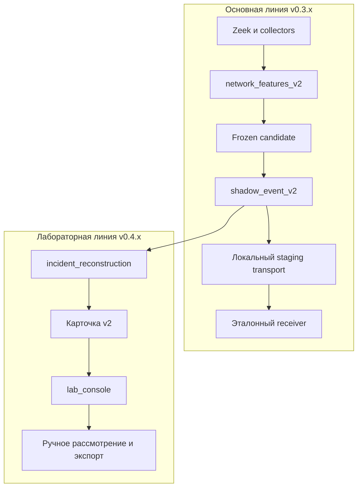
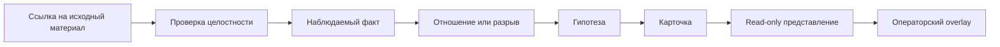
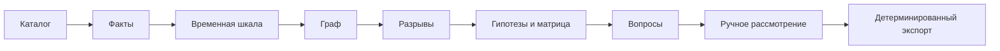
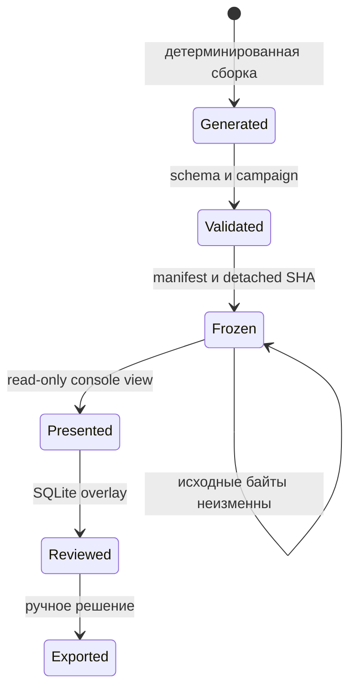

# Архитектура после v0.4.4

Текущая архитектура состоит из связанной основной линии `v0.3.x` и лабораторной
линии `v0.4.x`. Их связь техническая, но подтверждения и следующие этапы раздельны.

## Компонентная схема


```mermaid
flowchart TB
    subgraph MAIN["Основная линия v0.3.x"]
        Z["Zeek и collectors"] --> F["network_features_v2"]
        F --> M["Frozen candidate"]
        M --> E["shadow_event_v2"]
        E --> S["Локальный staging transport"]
        S --> R["Эталонный receiver"]
    end
    subgraph LAB["Лабораторная линия v0.4.x"]
        E --> IR["incident_reconstruction"]
        IR --> C["Карточка v2"]
        C --> LC["lab_console"]
        LC --> O["Ручное рассмотрение и экспорт"]
    end
```

## Основная линия v0.3.x

```text
контролируемый трафик → PCAP → Zeek → причинные признаки
→ зафиксированный кандидат → эпизодное решение → пассивное событие
→ локальная доставка → проверенный приёмник
```

Линия фиксирует происхождение кандидата, научные проверки, локальный runtime,
транспорт и процедуру будущей внешней проверки. Её текущая граница — `v0.3.18`;
следующий разрешённый шаг `v0.3.19` не является самим испытанием.

## Лабораторная линия v0.4.x

```text
пассивное событие → подтверждающие материалы → наблюдаемые факты
→ временная реконструкция → структурные отношения → разрывы → граф
→ конкурирующие гипотезы → карточка v2 → локальная консоль
→ ручное рассмотрение → безопасный экспорт
```

Завершён `v0.4.4`. Реализованы 12 синтетических случаев и сохраняемый операторский
цикл. Линия не меняет candidate artifact, preprocessing, calibration, conformal
policy или event contract.

## Поток подтверждающих материалов


```mermaid
flowchart LR
    A["Ссылка на исходный материал"] --> B["Проверка целостности"]
    B --> C["Наблюдаемый факт"]
    C --> D["Отношение или разрыв"]
    D --> E["Гипотеза"]
    E --> F["Карточка"]
    F --> G["Read-only представление"]
    G --> H["Операторский overlay"]
```

Операторские заметки, отметки и решение сохраняются отдельно. Они не становятся
evidence и не изменяют source bundle или semantic SHA.

## Операторский цикл


```mermaid
flowchart LR
    A["Каталог"] --> B["Факты"]
    B --> C["Временная шкала"]
    C --> D["Граф"]
    D --> E["Разрывы"]
    E --> F["Гипотезы и матрица"]
    F --> G["Вопросы"]
    G --> H["Ручное рассмотрение"]
    H --> I["Детерминированный экспорт"]
```

## Жизненный цикл артефакта


```mermaid
stateDiagram-v2
    [*] --> Generated: детерминированная сборка
    Generated --> Validated: schema и campaign
    Validated --> Frozen: manifest и detached SHA
    Frozen --> Presented: read-only console view
    Presented --> Reviewed: SQLite overlay
    Reviewed --> Exported: ручное решение
    Frozen --> Frozen: исходные байты неизменны
```

## Важные отрицания

- `v0.4.x` не изменяет модель и не заменяет внешнюю проверку;
- консоль не является backend или SIEM;
- исторический `backend/` не входит в текущий путь;
- temporal precedence не означает причинность;
- graph path не означает причинную цепочку;
- гипотеза и `better_supported` не означают установленную истину;
- operator notes не являются подтверждающими материалами.

Следующие страницы: [поток данных](end-to-end-data-flow.md),
[границы доверия](trust-boundaries.md) и [ограничения](limitations.md).
