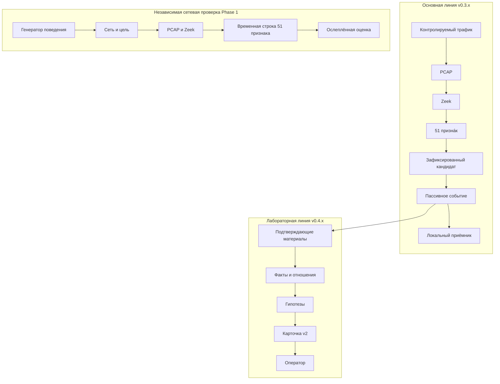
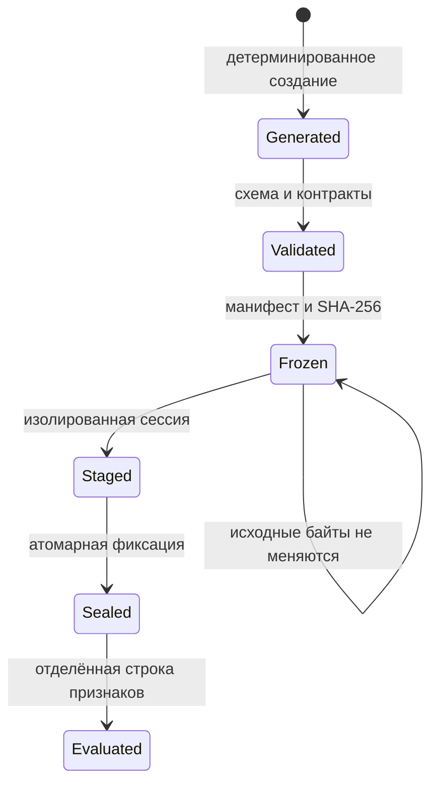

# Архитектурный обзор

Архитектура «Филина» состоит из основной продуктовой линии, лабораторной линии и отдельного технического контура независимой сетевой проверки. Они используют общие зафиксированные контракты, но имеют разные статусы, доказательства и разрешения.

## Три контура

```mermaid
flowchart TB
    subgraph MAIN["Основная линия v0.3.x"]
        T["Контролируемый трафик"] --> P["PCAP"] --> Z["Zeek"] --> F["51 призна́к"]
        F --> M["Зафиксированный кандидат"] --> E["Пассивное событие"] --> R["Локальный приёмник"]
    end
    subgraph LAB["Лабораторная линия v0.4.x"]
        E --> Q["Подтверждающие материалы"] --> I["Факты и отношения"] --> H["Гипотезы"] --> C["Карточка v2"] --> O["Оператор"]
    end
    subgraph NET["Независимая сетевая проверка Phase 1"]
        G["Генератор поведения"] --> N["Сеть и цель"] --> CP["PCAP и Zeek"] --> X["Временная строка 51 признака"]
        X --> B["Ослеплённая оценка"]
    end
```

## Основная линия

Поток основной линии: трафик → `PCAP` → `Zeek` → `network_features_v2` → кандидат → решение эпизода → `shadow_event_v2` → транспорт `staging` → приёмник `reference`. Кандидат `v03154:65a3dd912d845bc1` зафиксирован. Эта линия не утверждает внешнюю валидность и не предоставляет автоматического ответа.

## Лабораторная линия

Пассивное событие и ссылки на подтверждающие материалы преобразуются в наблюдаемые факты. Затем строятся временные и структурные отношения, явные разрывы и конкурирующие гипотезы. Карточка и ручные заметки хранятся раздельно: операторский слой не изменяет исходные подтверждающие материалы, их байты или контрольные суммы.

## Сетевой контур Phase 1

Официальный пакет — `network-validation-execution-8e1e32b127893bdf`, 288 шаблонов и 864 единицы выполнения. Матрица — `6 × 2 × 2 × 2 × 2 × 3`: поведения, семейства генераторов, профили инфраструктуры, цели, порты и уровни интенсивности. Каждому шаблону назначается ровно один режим фоновой активности — `http`, `dns`, `keepalive` или `combined`; каждый вариант встречается 72 раза. Это назначение не увеличивает число ячеек и не является дополнительным фактором.

Каждая единица имеет отдельный токен, целевую реализацию, семейство генератора и профиль. Первичное разбиение задаётся только повторением: `0` → `development_train`, `1` → `development_calibration`, `2` → `blind_internal_holdout`; сессия целиком остаётся в одном разбиении. Группировки по семейству генератора, профилю и цели используются отдельно в `analysis_views` для проверок невидимого семейства, инфраструктуры и цели. 24 контрфактуальные пары проверяют контролируемые изменения, а не причинность.

## Захват, Zeek и признаки

Клиент и цель запускаются в изолированной Docker-сети. Сначала фиксируется готовность, затем выполняется захват трафика. После остановки и сброса журналов Zeek строит `conn.log`, `http.log` и `dns.log`. Сырые PCAP и сырые журналы не редактируются.

Маркерные строки исключаются только в временной копии входа модели. HTTP-строка с префиксом `/sensor-marker/` исключается вместе со связанным UID из `conn.log`; DNS остаётся без изменения. Если один UID смешивает маркер и сценарий, обработка завершается `processing_integrity_failure`. В строку признаков маркерные метаданные не попадают.

Из очищенных журналов строится ровно одна числовая строка из 51 признака. Разрешённые источники — прямое наблюдение, детерминированный вывод, явное отсутствие и неподдерживаемое значение. Запрещены вывод по метке, сценарию, профилю и скрытому состоянию генератора. Полный перечень: [контракт построения признаков](../research/phase1-feature-construction.md).

## Сопоставление, ослепление и журнал

После `session_started` создаётся или проверяется одна запись сопоставления для `execution_token`; до этого момента научное поведение запускать нельзя. Оценщик получает только разрешённые поля отделённой строки с `evaluation_token`; `primary_split` и `split_assignment` запрещены. Соответствие `execution_token` и `evaluation_token` хранится отдельно от меток, а исходные PCAP, журналы Zeek и манифесты остаются за пределами его входных данных.

Каждая запись журнала добавляется в JSONL с последовательностью и цепочкой SHA-256. Отдельной записи `genesis` нет: первая запись ссылается на 64 нуля. Профиль Phase 1 разрешает только `session_started`, `session_completed`, `session_failed` и `retry_requested`; запечатывание, обработка Zeek и очистка являются внутренними этапами, а не событиями JSONL.

## Жизненный цикл артефакта

```mermaid
stateDiagram-v2
    [*] --> Generated: детерминированное создание
    Generated --> Validated: схема и контракты
    Validated --> Frozen: манифест и SHA-256
    Frozen --> Staged: изолированная сессия
    Staged --> Sealed: атомарная фиксация
    Sealed --> Evaluated: отделённая строка признаков
    Frozen --> Frozen: исходные байты не меняются
```

Научный результат не существует до выполнения всей разрешённой процедуры, фиксации прогнозов, раскрытия разметки по правилам и проверки критериев. Технический успех не означает научную приёмку.

## Текущий код и исторический пакет

Выпуск v4 зафиксировал среду выполнения до исправления запуска Zeek. Текущий код использует `/usr/local/zeek/bin/zeek` и `bash -c`; это изменение внесено после исходного коммита v4. Поэтому v4 остаётся последним официальным пакетом истории, но не является точным digest текущей среды выполнения. Нужен следующий заменяющий пакет. История: [пакеты Phase 1](../research/phase1-execution-package-history.md).

Исторически сообщённые две попытки с кодом Zeek `127` и нулём завершённых сессий не находятся в локальном наборе операционных записей и помечены как неподтверждённый внешний отчёт. Их нельзя смешивать с нулевым научным состоянием официального v4.

## Доверительные границы

- защищённые контракты, manifests, ledgers, raw PCAP и сырые журналы не редактируются;
- текущие русские страницы являются объяснительными проекциями и ссылаются на авторитетные источники;
- `runtime/` предназначен для локальных изменяемых результатов и не является доказательством;
- локальная консоль не является серверной частью или SIEM;
- исторический `backend/` не входит в проверенный текущий путь.

Связанные страницы: [сквозной поток данных](end-to-end-data-flow.md), [границы доверия](trust-boundaries.md), [текущие и исторические компоненты](current-vs-historical.md) и [ограничения](limitations.md).
