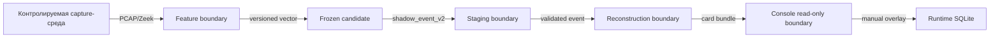

# Границы доверия

## Поток данных

## Правила

- каждый переход валидирует schema version и identity anchors;
- неизвестный candidate, contract или schema отклоняется;
- source evidence не доверяет operator overlay;
- console token не превращает localhost в публичную службу;
- runtime database не включается во frozen bundle автоматически;
- внешняя сторона получает только согласованный package scope.

## Не являющиеся доверием признаки

Label интерфейса, имя гипотезы, позиция на timeline и графическое соседство не
создают доказательную силу. Она определяется только источниками, контрактами и
зафиксированными assessment rules.
