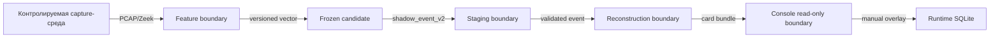

# Границы доверия

## Поток данных

## Правила

- каждый переход валидирует schema version и identity anchors;
- неизвестный кандидат, контракт или схема отклоняется;
- исходные подтверждающие материалы не считают изменяемый слой оператора доверенным;
- console token не превращает localhost в публичную службу;
- база данных среды выполнения не включается в зафиксированный комплект автоматически;
- внешняя сторона получает только согласованный package область применимости.

## Не являющиеся доверием признаки

Label интерфейса, имя гипотезы, позиция на временная последовательность и графическое соседство не
создают доказательную силу. Она определяется только источниками, контрактами и
зафиксированными assessment rules.
